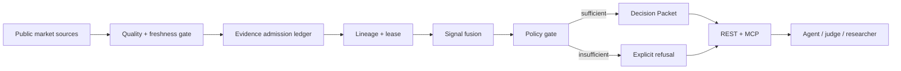

<p align="center">
  
</p>

<h1 align="center">SignalForge</h1>

<p align="center"><strong>Evidence before recommendation.</strong></p>
<p align="center">A pre-action evidence gate for market agents: admit usable evidence, refuse weak conclusions, and make every handoff inspectable.</p>

<p align="center">
  <a href="https://signalforge.faadil-casecraft.workers.dev"><strong>Live App</strong></a>
  ·
  <a href="https://signalforge.faadil-casecraft.workers.dev/judge/"><strong>Judge Proof Surface</strong></a>
  ·
  <a href="docs/JUDGE-DEMO.md"><strong>Demo Runbook</strong></a>
  ·
  <a href="docs/AGENT-INTEGRATION.md"><strong>Agent Integration</strong></a>
</p>

<p align="center"><sub>X-Agent MCP Hackathon 2026 · Live Cloudflare Worker · Read-only research authority</sub></p>

> **Current status**  
> The current SignalForge build is live on Cloudflare. The public runtime is bound to source commit `ada65fe9b2170a910d458f2db9855fe087ca9446` and Cloudflare Version ID `a7d93227-a130-4403-aa37-f992c3bd61ea`. Production runs with mock fallback disabled. Every Decision Packet preserves `execution_authorized: false`.

---

## Why SignalForge exists

### The pain

Market agents can receive a clean-looking score even when the evidence underneath it is stale, partial, concentrated in one provider, or simply unavailable.

That is dangerous because **an answer can look complete while its evidence is not**.

### The problem

Before an agent acts on a market conclusion, it should be able to answer:

- Which raw sources actually contributed?
- Which sources were excluded, and why?
- How fresh is each contributing input?
- Is the available coverage sufficient?
- Is confidence high enough to permit a directional handoff?
- What would invalidate the conclusion?
- What evidence would need to recover before another attempt?
- Can the result be verified later without trusting presentation copy?

Most signal tools optimize for producing an answer. SignalForge optimizes for deciding whether an answer is **admissible at all**.

### Why SignalForge is different

SignalForge turns live public market data into an evidence-bound Decision Packet.

- Raw inputs are freshness- and quality-gated before fusion.
- Missing evidence is excluded instead of silently becoming a neutral score.
- Coverage and confidence can force an explicit refusal.
- Every signal exposes provider and raw-input lineage.
- Every packet carries a freshness-bounded evidence lease.
- Recovery requirements describe necessary conditions without promising success.
- A SHA-256 receipt makes packet tampering detectable.
- REST and MCP expose the same bounded, read-only authority model.
- No product state authorizes trade execution.

**RAW SOURCE → ADMISSION / EXCLUSION → LINEAGE → LEASE → POLICY GATE → REFUSAL OR HANDOFF → RECEIPT**

---

## Live proof

The canonical runtime is:

```text
https://signalforge.faadil-casecraft.workers.dev
```

Core verification calls:

```bash
curl https://signalforge.faadil-casecraft.workers.dev/health
curl https://signalforge.faadil-casecraft.workers.dev/.well-known/xagent-verification.json
curl https://signalforge.faadil-casecraft.workers.dev/api/v1/decision/BTC
curl https://signalforge.faadil-casecraft.workers.dev/api/v1/decision/BTC/delta
curl "https://signalforge.faadil-casecraft.workers.dev/api/v1/validation/BTC?period_days=120&horizon_days=3"
curl https://signalforge.faadil-casecraft.workers.dev/api/v1/evidence/negative-path
```

The verified production snapshot established all of the following:

- `/health` returned `status: ok` and the exact deployed source commit.
- X-Agent verification returned the same commit and `slug: signalforge`.
- Production data mode was live-partial, not mock.
- Unavailable funding and open-interest evidence were excluded rather than invented.
- BTC actionability resolved to `insufficient_evidence` when confidence was below policy threshold.
- `execution_authorized` remained `false`.
- The negative-path fixture passed and preserved abstention under degraded evidence.
- Historical calibration disclosed that only the price-derived 3/5 subset is validated by that endpoint.

See [`docs/RUNTIME-PROOF.md`](docs/RUNTIME-PROOF.md) for the compact public receipt.

---

## Trust model

SignalForge is intentionally fail-closed.

| Condition | Product behavior |
|---|---|
| Fresh usable evidence | Eligible for admission |
| Stale / unavailable / inconsistent evidence | Excluded before fusion |
| Coverage below policy | Refuse directional handoff |
| Confidence below policy | Refuse directional handoff |
| Mock evidence in production | Not admitted as live evidence |
| Recovery requirement present | Necessary condition only; no guarantee |
| Packet integrity changed | Receipt verification fails |
| Agent asks for execution authority | Not granted |

Canonical rule:

```text
AVAILABLE != FRESH != CONSISTENT != ACTIONABLE
```

Production uses public market data with explicit provenance. Price-derived evidence can fall back to Coinbase Exchange when Binance endpoints are unavailable from the runtime environment. Funding and open interest remain unavailable when no supported live source is available.

---

## Real failure, controlled negative path

SignalForge anchors its refusal model in a real infrastructure failure class.

On **2025-04-15**, an AWS Tokyo connectivity incident affected Binance services. Public reporting described partial service disruption: some orders succeeded while others failed, and withdrawals were temporarily suspended.

SignalForge does **not** claim to have captured or replayed that historical event.

Instead, the product keeps the epistemic boundary explicit:

1. the historical incident is sourced external evidence;
2. the product reproduces the **failure class** with a controlled fixture;
3. degraded evidence must reduce usable coverage;
4. the system must abstain instead of manufacturing confidence.

Evidence records:

- [`evidence/real-failures/AWS-TOKYO-BINANCE-2025-04-15.md`](evidence/real-failures/AWS-TOKYO-BINANCE-2025-04-15.md)
- [`evidence/real-failures/aws-tokyo-binance-2025-04-15.json`](evidence/real-failures/aws-tokyo-binance-2025-04-15.json)

---

## Agent-native execution model

SignalForge exposes the same bounded contract through REST and stateless MCP.

### Capability contract

```http
GET /api/v1/capabilities
```

Describes tool contracts, state semantics, protocol versions, side-effect boundaries, safe-failure behavior, and authority limits.

### Decision Packet

```http
GET /api/v1/decision/BTC
```

Includes:

- stance and composite score;
- confidence and coverage;
- actionability state;
- evidence grouped as supporting / contradicting / neutral;
- source freshness and provenance;
- evidence admission ledger;
- provider/raw-input lineage;
- evidence lease with `valid_until`;
- recovery requirements;
- invalidation conditions;
- next safe agent action;
- snapshot ID;
- tamper-evident SHA-256 receipt;
- `execution_authorized: false`.

### MCP

```http
POST /mcp
MCP-Protocol-Version: 2026-07-28
```

Supported methods:

- `server/discover`
- `tools/list`
- `tools/call`

Current tools include decision retrieval, stateless comparison, stress testing, receipt verification, bounded calibration, negative-path inspection, and evidence-resilience checks.

The MCP surface is read-only and does not execute trades.

---

## Architecture



Core runtime:

- **FastAPI / Python** — market, decision, evidence, recovery, validation and MCP services.
- **Next.js** — live product and judge-facing proof surfaces.
- **Cloudflare Worker** — one public origin for static UI and Python API runtime.
- **Public market providers** — source data with explicit per-source provenance.
- **Decision receipts** — deterministic packet-integrity verification.

More detail: [`docs/ARCHITECTURE.md`](docs/ARCHITECTURE.md).

---

## Judge path

The fastest review path is [`/judge/`](https://signalforge.faadil-casecraft.workers.dev/judge/).

A useful sequence is:

1. verify `/health` and X-Agent commit binding;
2. inspect the BTC Decision Packet;
3. inspect what evidence was admitted or excluded;
4. inspect lease, lineage, confidence and coverage;
5. show the negative path and refusal behavior;
6. show bounded historical calibration;
7. inspect MCP discovery and one read-only tool call.

Runbook: [`docs/JUDGE-DEMO.md`](docs/JUDGE-DEMO.md).

---

## Repository guide

The public repository is intentionally submission-focused:

- `api/` — FastAPI, decision, evidence, recovery, market-data and MCP services
- `web/` — product UI and judge proof surface
- `tests/` — deterministic policy, API, recovery and provider-fallback coverage
- `evidence/real-failures/` — sourced public failure evidence used by the negative path
- `docs/ARCHITECTURE.md` — compact system map
- `docs/AGENT-INTEGRATION.md` — REST/MCP integration contract
- `docs/JUDGE-DEMO.md` — reviewer runbook
- `docs/RUNTIME-PROOF.md` — public runtime binding and proof summary
- `docs/RUNTIME-DEPLOYMENT.md` — deployment notes

Internal research, design exploration, naming studies, strategy notes, operational handovers, and private working-state files are intentionally excluded from the submission tree.

---

## Development

Backend:

```bash
uv sync --locked --all-groups
uv run pytest
```

Frontend:

```bash
cd web
npm ci
npm run lint
npm run build
```

Cloudflare bundle verification:

```powershell
$env:CLOUDFLARE_STATIC_EXPORT = "1"
cd web
npm run build
cd ..
uv run pywrangler deploy --dry-run
```

---

## Product boundaries

SignalForge is a research and evidence-admission system.

It does **not** claim:

- autonomous trading authority;
- guaranteed profitability;
- full five-signal historical validation;
- statistical independence between signals;
- that a freshness lease guarantees forecast validity;
- that restoring missing evidence guarantees a directional conclusion;
- that an integrity receipt is a cryptographic identity signature.

Every public Decision Packet keeps execution authority external.

---

## Team

- **Faadil Boussari** — product / repo lead
- **Opeyemi (`opeblow`)** — collaborator / technical lead

## License

MIT — see [`LICENSE`](LICENSE).
