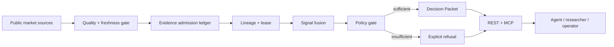

<p align="center">
  
</p>

<h1 align="center">SignalForge</h1>

<p align="center"><strong>Evidence before recommendation.</strong></p>
<p align="center">A pre-action evidence gate for market agents: admit usable evidence, refuse weak conclusions, and make every handoff inspectable.</p>

<p align="center">
  <a href="https://signalforge.faadil-casecraft.workers.dev"><strong>Live App</strong></a>
  ·
  <a href="docs/DEMO.md"><strong>Demo Guide</strong></a>
  ·
  <a href="docs/AGENT-INTEGRATION.md"><strong>Agent Integration</strong></a>
  ·
  <a href="docs/RUNTIME-PROOF.md"><strong>Runtime Proof</strong></a>
</p>

<p align="center"><sub>X-Agent MCP Hackathon 2026 · Cloudflare Worker · REST + MCP · Read-only authority</sub></p>

> **Current status**  
> SignalForge is live on Cloudflare with mock fallback disabled and execution authority kept external. The final public product surface is bound to source commit `087a9d9db98b5ec53da04bae0e8b07f2a4b7f976`, Cloudflare Version ID `e1414c91-2e7b-408b-970c-0e7f4df6f3c6`, and the same commit is exposed by both `/health` and `/.well-known/xagent-verification.json`.

---

## Why SignalForge exists

### The pain

**A market agent can receive a clean-looking score even when the evidence underneath it is stale, partial, contradictory, or unavailable.**

The dangerous failure is not only getting a bad answer. It is getting an answer that looks complete when its evidence is not.

### The problem

Before an agent acts on a market conclusion, it should be able to answer:

- Which raw sources actually contributed?
- Which sources were excluded, and why?
- How fresh is each input?
- Is usable coverage high enough?
- Is confidence high enough for a directional handoff?
- What contradicts the conclusion?
- What would invalidate it?
- What evidence must recover before another attempt?
- Can the result be verified later without trusting presentation copy?

Most signal products optimize for producing an answer. SignalForge first decides whether an answer is **admissible at all**.

### Why SignalForge is different

SignalForge turns live public market data into an evidence-bound **Decision Packet**.

- Raw inputs pass freshness and quality gates before fusion.
- Missing evidence is excluded instead of silently becoming a neutral score.
- Coverage and confidence can force an explicit refusal.
- Supporting, contradicting and neutral evidence remain visible.
- Every admitted signal exposes provider and raw-input lineage.
- Every packet carries a freshness-bounded evidence lease.
- Recovery requirements state necessary conditions without promising success.
- A SHA-256 receipt makes packet tampering detectable.
- REST and MCP expose the same bounded, read-only authority model.
- SignalForge never grants trade execution authority.

**SOURCE → ADMIT / EXCLUDE → LINEAGE → LEASE → POLICY GATE → REFUSE OR HANDOFF → RECEIPT**

Without an evidence gate, an agent can confuse “data returned” with “decision justified.” SignalForge makes that distinction explicit.

---

## The product flow

| Step | What happens |
|---|---|
| Inspect market evidence | Pull public market inputs with provider provenance |
| Admit or exclude | Reject stale, unavailable or inconsistent evidence before fusion |
| Build the packet | Group support, contradiction, coverage, confidence and lineage |
| Apply the policy gate | Refuse a directional handoff when evidence is insufficient |
| Lease the conclusion | Bound the packet with `valid_until` and invalidation conditions |
| Verify later | Recompute the SHA-256 receipt and inspect the exact runtime source |
| Expose to agents | Serve the same bounded contract through REST and MCP |

The product story is simple: **do not ask an agent to trust the score until the evidence underneath the score has earned admission.**

---

## Live product

Canonical runtime:

```text
https://signalforge.faadil-casecraft.workers.dev
```

Core surfaces:

- `/` — product overview
- `/dashboard` — evidence and decision state
- `/token` — token-level signal inspection
- `/playground` — interactive research surface
- `/strategies` — strategy context
- `/api/v1/decision/BTC` — evidence-bound Decision Packet
- `/api/v1/capabilities` — machine-readable capability contract
- `/mcp` — stateless MCP endpoint

The final public product intentionally has **no internal readiness scorecard or judge-only barometer**. Verification happens through the same public runtime and documented proof endpoints.

---

## Trust model

SignalForge is intentionally fail-closed.

| Condition | Product behavior |
|---|---|
| Fresh usable evidence | Eligible for admission |
| Stale / unavailable / inconsistent evidence | Excluded before fusion |
| Coverage below policy | Refuse directional handoff |
| Confidence below policy | Refuse directional handoff |
| Mock evidence in production | Not admitted as live evidence |
| Recovery requirement present | Necessary condition only; no guarantee |
| Packet integrity changed | Receipt verification fails |
| Agent asks for execution authority | Not granted |

Canonical rule:

```text
AVAILABLE != FRESH != CONSISTENT != ACTIONABLE
```

Production uses public market data with explicit provenance. Price-derived evidence can fall back to Coinbase Exchange when Binance endpoints are unavailable from the runtime environment. Funding and open interest stay unavailable when no supported live source is available.

---

## Evidence and runtime proof

A release is considered bound only when the public runtime identifies the exact source that produced it.

```bash
curl https://signalforge.faadil-casecraft.workers.dev/health
curl https://signalforge.faadil-casecraft.workers.dev/.well-known/xagent-verification.json
```

The final public verification established:

- homepage returned HTTP `200`;
- the internal `/judge/` surface returns `404`;
- the homepage contains none of the removed internal process markers;
- `/health` returns `status: ok`;
- `/health` exposes source commit `087a9d9db98b5ec53da04bae0e8b07f2a4b7f976`;
- X-Agent verification exposes the same commit and `slug: signalforge`;
- mock fallback is disabled;
- the final clean frontend export uploaded 36 new or modified static assets to Cloudflare;
- the deployed Cloudflare Version ID is `e1414c91-2e7b-408b-970c-0e7f4df6f3c6`.

Full receipt: [`docs/RUNTIME-PROOF.md`](docs/RUNTIME-PROOF.md).

---

## Real failure, controlled negative path

SignalForge anchors its refusal model in a real infrastructure failure class.

On **2025-04-15**, an AWS Tokyo connectivity incident affected Binance services. Public reporting described partial service disruption: some orders succeeded while others failed, and withdrawals were temporarily suspended.

SignalForge does **not** claim to have captured or replayed that historical event.

Instead, it preserves the epistemic boundary:

1. the historical incident is sourced external evidence;
2. the product reproduces the **failure class** with a controlled fixture;
3. degraded evidence must reduce usable coverage;
4. the system must abstain instead of manufacturing confidence.

Evidence records:

- [`evidence/real-failures/AWS-TOKYO-BINANCE-2025-04-15.md`](evidence/real-failures/AWS-TOKYO-BINANCE-2025-04-15.md)
- [`evidence/real-failures/aws-tokyo-binance-2025-04-15.json`](evidence/real-failures/aws-tokyo-binance-2025-04-15.json)

---

## Agent-native contract

### Decision Packet

```http
GET /api/v1/decision/BTC
```

A packet can include:

- stance and composite score;
- confidence and usable coverage;
- actionability state;
- supporting / contradicting / neutral evidence;
- evidence admission ledger;
- provider and raw-input lineage;
- freshness lease with `valid_until`;
- recovery requirements;
- invalidation conditions;
- next safe agent action;
- snapshot ID;
- tamper-evident SHA-256 receipt;
- `execution_authorized: false`.

### Capability contract

```http
GET /api/v1/capabilities
```

Describes tool contracts, protocol versions, safe-failure behavior, side-effect boundaries and authority limits.

### MCP

```http
POST /mcp
MCP-Protocol-Version: 2026-07-28
```

Supported methods include `server/discover`, `tools/list`, and `tools/call` for decision retrieval, stateless comparison, stress testing, receipt verification, bounded calibration, negative-path inspection and evidence-resilience checks.

The MCP surface is read-only and does not execute trades.

---

## Architecture



- **FastAPI / Python** — market, decision, evidence, recovery, validation and MCP services.
- **Next.js** — public product interface.
- **Cloudflare Worker** — one origin for static UI and Python API runtime.
- **Public market providers** — source data with explicit per-source provenance.
- **Decision receipts** — deterministic packet-integrity verification.

See [`docs/ARCHITECTURE.md`](docs/ARCHITECTURE.md).

---

## Demo

The recommended walkthrough uses the real public product and the same endpoints available to agents:

1. open the live product;
2. inspect the dashboard and one token;
3. open the BTC Decision Packet;
4. identify admitted and excluded evidence;
5. inspect coverage, confidence, lineage and `valid_until`;
6. trigger the controlled negative path and show the refusal behavior;
7. inspect MCP discovery / one read-only tool call;
8. close on `/health` + X-Agent source binding.

Guide: [`docs/DEMO.md`](docs/DEMO.md).

A deterministic Remotion / HyperFrames demo-video package is kept under [`video/`](video/) so the edit can be regenerated from the public product instead of relying on an opaque exported timeline.

---

## Engineering challenges

### Refusing to turn missing data into fake neutrality

Unavailable inputs originally risked looking equivalent to a valid neutral signal. SignalForge now excludes unavailable evidence before fusion and surfaces the resulting evidence debt explicitly.

### Keeping recovery bounded

A recovery plan can identify what must become fresh or available again, but it cannot promise that the next Decision Packet will become directional. Recovery conditions are necessary, not sufficient.

### Making provenance inspectable by both humans and agents

The UI, REST contract and MCP tools use the same evidence semantics so an agent does not receive a more permissive interpretation than the human-facing product.

### Binding the live runtime to exact source

The production Worker exposes its Git commit through `/health` and the X-Agent verification document. A deployment is not treated as bound unless those values agree with the source used to build it.

---

## Security and authority boundaries

- SignalForge is read-only with respect to trading.
- `execution_authorized` remains `false` in public Decision Packets.
- Missing evidence is never synthesized into a stronger conclusion.
- Integrity receipts detect packet mutation; they are not identity signatures.
- Freshness leases bound evidence age; they do not guarantee forecast validity.
- Recovery requirements do not guarantee actionability.
- Production mock fallback is disabled.

See [`SECURITY.md`](SECURITY.md).

---

## Repository guide

The public `main` branch is intentionally submission-focused:

- `api/` — FastAPI, market-data, decision, evidence, recovery and MCP services
- `web/` — public product UI
- `tests/` — deterministic policy, API, recovery and provider-fallback coverage
- `evidence/real-failures/` — sourced public failure evidence used by the negative path
- `docs/` — concise architecture, integration, demo, deployment and runtime-proof material
- `video/` — reproducible demo-video source and capture workflow

Internal research, strategy notes, private working documents, readiness scorecards, transcript analysis and operational handovers are intentionally **not part of the public submission tree**.

---

## Development

Backend:

```bash
uv sync --locked --all-groups
uv run pytest
```

Frontend:

```bash
cd web
npm ci
npm run lint
npm run build
```

Cloudflare bundle verification:

```powershell
$env:CLOUDFLARE_STATIC_EXPORT = "1"
cd web
npm run build
cd ..
uv run pywrangler deploy --dry-run
```

---

## Product boundaries

SignalForge does **not** claim:

- autonomous trading authority;
- guaranteed profitability;
- full five-signal historical validation;
- statistical independence between signals;
- that a freshness lease guarantees forecast validity;
- that restoring missing evidence guarantees a directional conclusion;
- that an integrity receipt is a cryptographic identity signature.

Every public Decision Packet keeps execution authority external.

---

## Useful links

- [Live App](https://signalforge.faadil-casecraft.workers.dev)
- [Demo Guide](docs/DEMO.md)
- [Agent Integration](docs/AGENT-INTEGRATION.md)
- [Architecture](docs/ARCHITECTURE.md)
- [Runtime Proof](docs/RUNTIME-PROOF.md)
- [Security](SECURITY.md)

## License

MIT — see [`LICENSE`](LICENSE).
