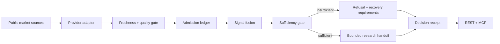

<p align="center">
  
</p>

<h1 align="center">SignalForge</h1>

<p align="center"><strong>Prove the right to conclude.</strong></p>
<p align="center">A read-only evidence gate for market agents that refuses false confidence when live evidence is incomplete, stale, inconsistent, or unavailable.</p>

<p align="center">
  <a href="https://signalforge.faadil-casecraft.workers.dev"><strong>Live App</strong></a>
  ·
  <a href="https://signalforge.faadil-casecraft.workers.dev/judge/"><strong>Judge Proof Surface</strong></a>
  ·
  <a href="docs/AGENT-INTEGRATION.md"><strong>Agent Integration</strong></a>
  ·
  <a href="docs/OPERATIONS.md"><strong>Operations</strong></a>
</p>

<p align="center"><sub>X-Agent AI MCP Hackathon 2026 · Open Innovation · Read-only · No execution authority</sub></p>

> **Current status**  
> SignalForge is live on Cloudflare. Production is bound to reviewed source commit `ada65fe9b2170a910d458f2db9855fe087ca9446`, synthetic fallback is disabled, and every decision path preserves `execution_authorized: false`. The public runtime may operate in `live_partial` mode when some upstream evidence is unavailable; unavailable evidence is excluded rather than invented.

---

## Why SignalForge exists

### The pain

Market agents can receive a technically valid response and still be reasoning from bad evidence.

A provider can be reachable while the data is stale. One source can fail while another remains live. A dashboard can still display a score even when key inputs have disappeared. If those states are collapsed into a single number, an agent can become confidently wrong.

### The problem

Before a market agent uses a signal, it needs to know:

- which sources actually contributed;
- whether those sources are fresh enough for the current policy;
- which evidence was excluded and why;
- whether the remaining evidence still meets coverage and confidence gates;
- how fragile the conclusion is to missing inputs;
- what would invalidate the current state;
- whether the result is only suitable for research or has execution authority.

A `200 OK` is not evidence quality.

### Why SignalForge is different

SignalForge treats evidence admission as the product, not a hidden implementation detail.

**Raw source → admission/exclusion → lineage → freshness lease → sufficiency gate → refusal or research handoff → receipt**

The core rule is simple:

```text
AVAILABLE != FRESH != CONSISTENT != ACTIONABLE
```

When evidence is insufficient, SignalForge does not manufacture a neutral-looking answer. It returns a machine-readable refusal and a safe next action.

---

## What the product returns

`GET /api/v1/decision/BTC` returns a versioned Decision Packet with:

- stance and composite score;
- confidence and coverage;
- actionability state;
- supporting, contradicting, and neutral evidence;
- per-source provenance and freshness;
- evidence admission ledger;
- raw-input/provider lineage;
- freshness-bounded evidence lease;
- recovery requirements;
- invalidation conditions;
- agent next action;
- tamper-evident SHA-256 receipt;
- explicit `execution_authorized: false`.

The packet is intentionally bounded. It is a research handoff, not an order, recommendation guarantee, risk approval, or trading authorization.

---

## Live evidence model

SignalForge can combine five evidence channels:

| Channel | Weight | Role |
|---|---:|---|
| Technical | 25% | RSI + moving-average structure |
| Trend | 25% | Price direction + recent structure |
| Funding | 20% | Funding-rate crowding |
| Open Interest | 15% | Positioning intensity |
| Volume | 15% | Directional volume behavior |

Production uses public market-data providers with explicit provenance. Binance is attempted where available; price-derived ticker and kline evidence can fail over to Coinbase Exchange. Funding and open-interest remain unavailable when a supported live source is unavailable.

Missing evidence is removed from the usable fusion denominator. Coverage and adjusted confidence then determine whether a directional research handoff is allowed to exist.

---

## Execution

SignalForge separates collection, quality policy, evidence reasoning, and agent transport so that no single upstream response becomes trusted automatically.



- **FastAPI** exposes the evidence, decision, validation, recovery, and capability contracts.
- **Next.js** provides the live product and reviewer-facing proof surface.
- **Cloudflare Workers** serves the static UI and Python API from one public origin.
- **REST + MCP** expose the same read-only authority boundary to agents.
- **Decision receipts** bind material fields to a deterministic SHA-256 digest.

---

## Agent-native REST + MCP

SignalForge exposes the same bounded capability through two read-only surfaces:

- REST under `/api/v1/*`
- stateless MCP at `POST /mcp`

Current MCP methods:

- `server/discover`
- `tools/list`
- `tools/call`

Current read-only tools include:

- `get_decision_packet`
- `compare_decision_packet`
- `stress_test_decision`
- `verify_decision_receipt`
- `validate_price_signals`
- `inspect_negative_path`
- `run_evidence_resilience_benchmark`

See [`docs/AGENT-INTEGRATION.md`](docs/AGENT-INTEGRATION.md) for the transport contract and examples.

---

## Evidence and refusal proof

SignalForge includes both a sourced external failure case and a controlled failure-class reproduction.

The historical reference is the **2025-04-15 AWS Tokyo connectivity incident affecting Binance services**. SignalForge does not claim it was running during that event and does not claim to replay historical Binance payloads.

The controlled negative path reproduces the relevant evidence condition: price evidence remains fresh while open-interest is stale and funding is unavailable. The expected result is:

```text
actionability = insufficient_evidence
execution_authorized = false
```

Public evidence records:

- [`evidence/real-failures/AWS-TOKYO-BINANCE-2025-04-15.md`](evidence/real-failures/AWS-TOKYO-BINANCE-2025-04-15.md)
- [`evidence/real-failures/aws-tokyo-binance-2025-04-15.json`](evidence/real-failures/aws-tokyo-binance-2025-04-15.json)

The live negative-path endpoint is:

```http
GET /api/v1/evidence/negative-path
```

---

## Judge proof surface

The recommended reviewer path is:

**https://signalforge.faadil-casecraft.workers.dev/judge/**

Core public checks:

```text
GET /health
GET /.well-known/xagent-verification.json
GET /api/v1/decision/BTC
GET /api/v1/decision/BTC/delta
GET /api/v1/validation/BTC?period_days=120&horizon_days=3
GET /api/v1/evidence/negative-path
GET /api/v1/capabilities
GET /api/v1/evidence/resilience-benchmark
GET /api/v1/decision/BTC/stress
POST /api/v1/decision/verify-receipt
POST /mcp
```

The deployment identity is part of the proof. `/health` and `/.well-known/xagent-verification.json` expose the exact runtime source commit.

See [`docs/JUDGE-DEMO.md`](docs/JUDGE-DEMO.md) for the short demo path.

---

## Validation boundary

SignalForge includes a historical calibration surface for the price-derived portion of the model:

```http
GET /api/v1/validation/BTC?period_days=120&horizon_days=3
```

The current public contract explicitly reports:

```json
{
  "validation_scope": "price_derived_3_of_5",
  "full_composite_validated": false,
  "included_signals": ["technical", "trend", "volume"],
  "omitted_signals": ["funding", "open_interest"]
}
```

That boundary is deliberate. The repository does not claim full five-channel historical validation or profitability.

---

## Engineering challenges

### Failing over without pretending the evidence is complete

Cloudflare could reach Coinbase price data when some Binance paths were unavailable. The system therefore restores only semantically compatible price-derived evidence and keeps funding/open-interest unavailable instead of synthesizing them.

### Keeping serverless comparisons honest

A convenience delta endpoint can use process memory, but Worker isolates are not durable global state. SignalForge therefore also provides a stateless comparison path where the caller supplies the prior Decision Packet.

### Making degradation testable

The resilience benchmark uses controlled evidence states to verify policy behavior under stale, unavailable, inconsistent, and mock-removed inputs. It measures policy conformance, not trading performance.

### Separating integrity from truth

Decision receipts detect changes to bound packet fields. They are integrity receipts, not digital signatures, identity proofs, or guarantees that the underlying market conclusion is correct.

---

## Security and authority model

- Production synthetic fallback is disabled.
- Untrusted or degraded evidence is excluded before fusion.
- MCP is stateless, read-only, and side-effect free.
- Every Decision Packet and MCP result preserves `execution_authorized: false`.
- Rate limiting and structured caller errors are part of the public API boundary.
- Receipt verification is deterministic and does not fetch fresh market data.
- No wallet, brokerage, exchange-order, or autonomous execution path is included.

See [`SECURITY.md`](SECURITY.md).

---

## Repository guide

The public repository is intentionally compact for reviewers and contributors:

- `api/` — FastAPI routes, evidence policy, market adapters, decision/recovery services, MCP
- `web/` — Next.js product UI and judge proof surface
- `tests/` — deterministic backend, policy, MCP, fallback, and API coverage
- `evidence/real-failures/` — public sourced failure evidence used by the negative path
- `docs/AGENT-INTEGRATION.md` — REST/MCP integration contract
- `docs/JUDGE-DEMO.md` — short reviewer runbook
- `docs/OPERATIONS.md` — release and runtime invariants
- `docs/RUNTIME-DEPLOYMENT.md` — Cloudflare deployment details

Internal research, competitive analysis, design-process notes, naming work, private handovers, and submission-planning artifacts are intentionally excluded from the public tree.

---

## Development

Backend:

```bash
uv sync --locked --all-groups
uv run pytest -q
```

Frontend:

```bash
cd web
npm ci
npm run lint
npx tsc --noEmit
npm run build
```

Cloudflare bundle verification:

```bash
uv run pywrangler deploy --dry-run
```

---

## Useful links

- [Live App](https://signalforge.faadil-casecraft.workers.dev)
- [Judge Proof Surface](https://signalforge.faadil-casecraft.workers.dev/judge/)
- [Agent Integration](docs/AGENT-INTEGRATION.md)
- [Judge Demo](docs/JUDGE-DEMO.md)
- [Operations](docs/OPERATIONS.md)
- [Runtime Deployment](docs/RUNTIME-DEPLOYMENT.md)
- [Security](SECURITY.md)

## License

MIT — see [`LICENSE`](LICENSE).
