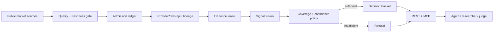

# SignalForge Architecture

SignalForge is a read-only market evidence gate. It collects public market evidence, evaluates whether that evidence is usable, and returns either a bounded Decision Packet or an explicit refusal state.

## Runtime flow



## Components

### Market acquisition

`api/services/binance_client.py` and `api/cloudflare_binance_adapter.py` acquire public market data and preserve source provenance. Price-derived evidence can use Coinbase Exchange as a fallback when Binance endpoints are unavailable from the Cloudflare environment.

Funding and open-interest evidence are not synthesized when their supported live sources are unavailable.

### Data-quality gate

`api/services/data_quality.py` classifies each raw source as fresh, stale, unavailable, unknown, inconsistent, or mock.

Evidence that fails the current quality policy is removed before fusion.

### Evidence admission and lineage

`api/services/evidence_intelligence.py` produces:

- the evidence admission ledger;
- raw-input/provider lineage;
- provider concentration diagnostics;
- freshness-bounded evidence leases;
- recovery requirements;
- current-policy fragility diagnostics.

Admission means a source passed the current evidence-quality gate and contributes to an available signal. It does not imply predictive validity or execution authority.

### Decision service

`api/services/decision_service.py` combines admitted signals into a bounded Decision Packet with:

- score;
- confidence;
- coverage;
- actionability;
- evidence groups;
- provenance;
- lease and recovery state;
- invalidation conditions;
- next safe agent action;
- snapshot identifier;
- integrity receipt;
- `execution_authorized: false`.

### Recovery and verification

`api/services/recovery_service.py` describes what evidence conditions would need to improve before another decision attempt. Recovery conditions are necessary conditions only and do not guarantee a directional result.

Receipt verification recomputes a deterministic SHA-256 digest over bound packet fields. This proves packet integrity, not signer identity.

### API and MCP

FastAPI exposes REST endpoints under `/api/v1/*` plus the stateless MCP request/response endpoint at `/mcp`.

Both surfaces are read-only with respect to markets and wallets. SignalForge does not place orders, access wallets, move funds, or grant execution authority.

### Web UI

The Next.js application exposes:

- the product lifecycle view;
- live decision/evidence surfaces;
- token-level forensic evidence views;
- calibration and playground surfaces;
- `/judge/` for direct proof inspection.

### Cloudflare deployment

The judged runtime uses one Cloudflare Worker origin:

- Next.js is exported as static assets;
- the Python FastAPI application runs through the Cloudflare Worker adapter;
- API/proof paths are routed through the Worker;
- judge-facing UI and API therefore share one origin.

See [`RUNTIME-DEPLOYMENT.md`](RUNTIME-DEPLOYMENT.md) for deployment mechanics and [`RUNTIME-PROOF.md`](RUNTIME-PROOF.md) for the currently verified production binding.

## Authority boundary

SignalForge's output is a research handoff, not an execution instruction.

```text
SignalForge authority: research_only
External execution authority required: true
Execution authorized: false
```
